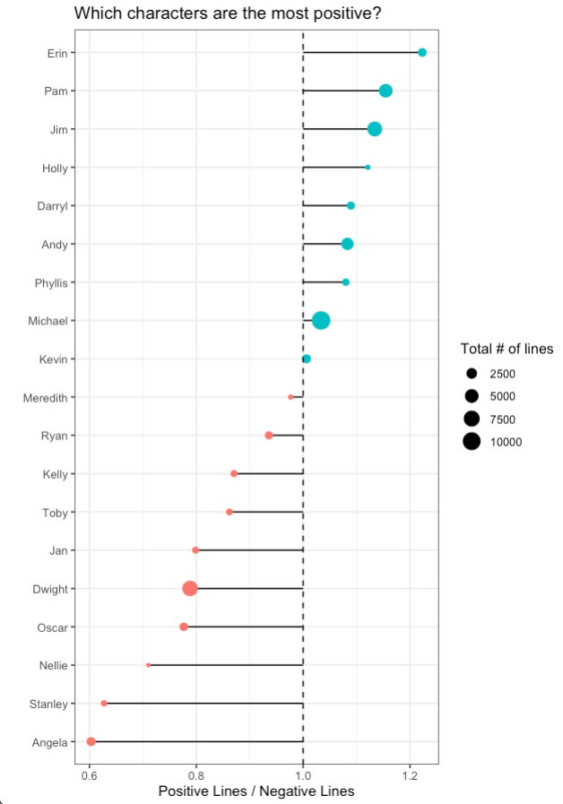
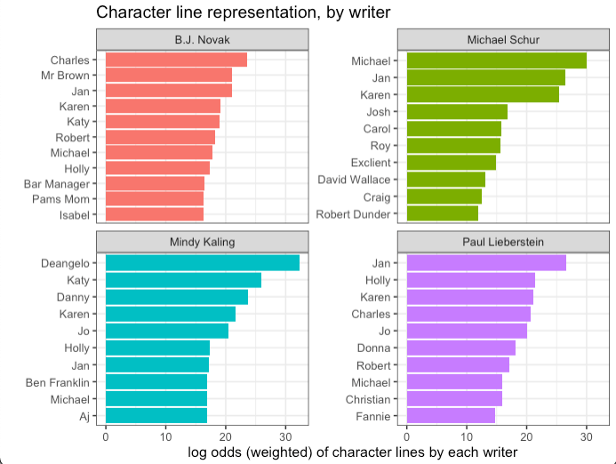
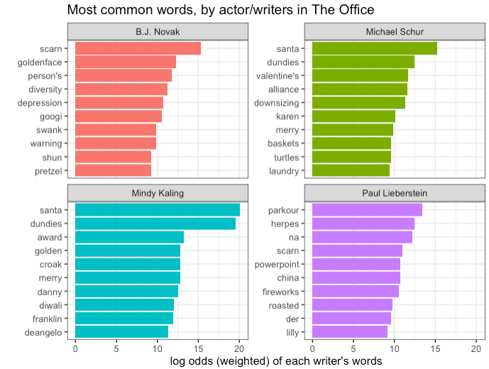

# office-viz
Processing and visualization around The Office scripts, using tidy tuesday and schrute library for episode metadata

# Sentiment Analysis!
I ran the shrute library script text through Amazon Comprehend -- this gives each line both a classifier (Positive, Neutral, or Negative) and a quantitative score to represent the strength of that sentiment, for each line. If we look at the ratio of total positive lines to negative lines, we can get a look into who the most positive or negative characters are!

Interesting to note here -- all of the show's couples fall on the same side of the ratio line!  Positive couples (Jim/Pam, Holly/Michael, Erin/Andy) on the top half, with negative couples (Kelly/Ryan, Dwight/Angela) on the bottom! Opposites don't really attract in Scranton, I suppose. Another interesting takeaway -- the more positive characters appear to have stronger representation with lines over the course of the entire series. The only major character in the Negative section is Dwight -- but there's quite a few major characters on the positive end of this spectrum.

# What happens when writers write their own characters? 
This show has four writers who also have smaller parts in the show. I was wondering if they had a tendency to write more or fewer lines for their own characters -- to investigate this, I looked at the log odds of the number of lines written for the different characters across all of the episodes that they wrote.

The interesting thing here is that the characters played by each writer are NOT highly-represented here! They aren't writing their own characters more lines. There could be a lot going on here -- one theory is that the writers were pulled in to act more for episodes written by OTHER writers? With 40+ writers involved across the entire series, it's possible!

# Do writers tackle specific or different topics? 
Looking at the set of words that each writer used, we can use log odds here as well to identify words that are more commonly-associated with each writer! Normal stop words were removed, along with character names, and a few office-specific filler words ("yeah", "uh", "hey", or "hum"). Since there are so many writers, focusing again here on the 4 writers who also appear as characters in the show.

